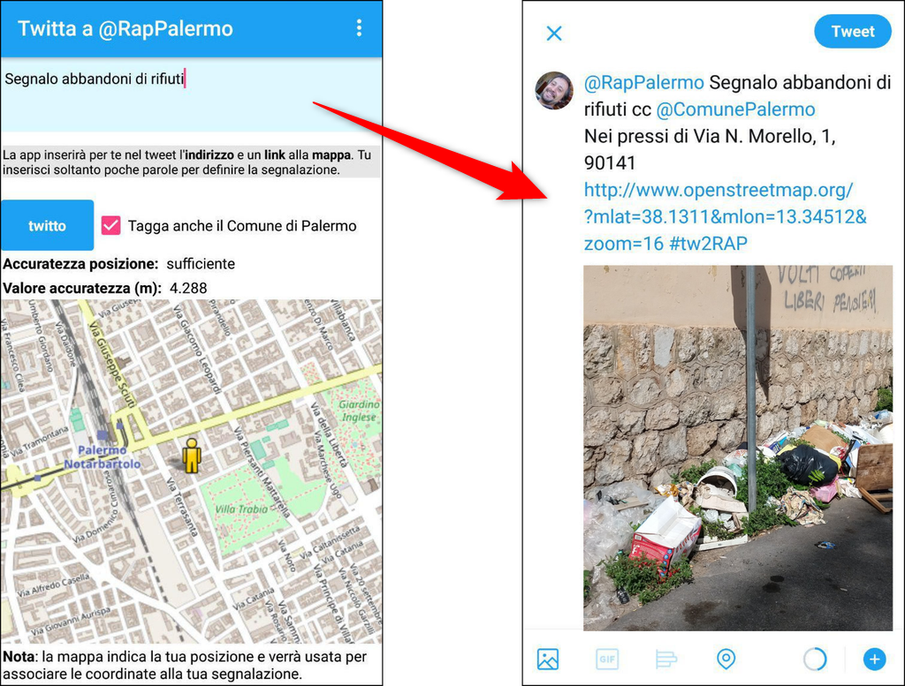

# Twitter2RAP

Fare una **segnalazione** a chi gestisce servizi di **Raccolta e Igiene Ambientale** deve essere **facile**, **rapido** e **completo**.

A Palermo uno dei modi per farle alla RAP - l'azienda che gestisce in città la nettezza urbana - è usare **Twitter**. Allora è stata costruita un'applicazione per Android che ti chiede soltanto di descrivere (opzionalmente) quello che hai davanti agli occhi e fargli una foto. Lei per te:

- **taggherà** **@RapPalermo** e opzionalmente **@ComunePalermo**;
- inserirà l'**indirizzo** del punto in cui ti  trovi;
- inserirà l'**URL** a una **mappa** con le **coordinate geografiche**;
- allegherà la **foto**.

Tu scrivi ad esempio soltanto "Segnalo abbandono di rifiuti", fai la foto e tutto il resto lo farà Twitter2RAP (vedi sotto)

.

## Note per il corretto funzionamento

Alcune note:

- è pensata per essere **usata a caldo**, nel momento in cui vedi qualcosa da segnalare;
- richiede l'accesso alla **fotocamera** e al **sensore GPS**;
- la segnalazione non verrà fatta se l'**accuratezza GPS è superiore a 15 metri**.

## Obiettivo di fondo

Sono due gli obiettivi principali:

- fare in modo che sia **facile**, **rapido** e **completo** per i cittadini fare queste segnalazioni;
- fare in modo che alla RAP arrivino dei messaggi con informazioni aeguate per poter fare la valutazione delle segnalazioni ricevute.

È il cosidetto **_Win_**, **_Win_**, perché i vantaggi sono per tutti.